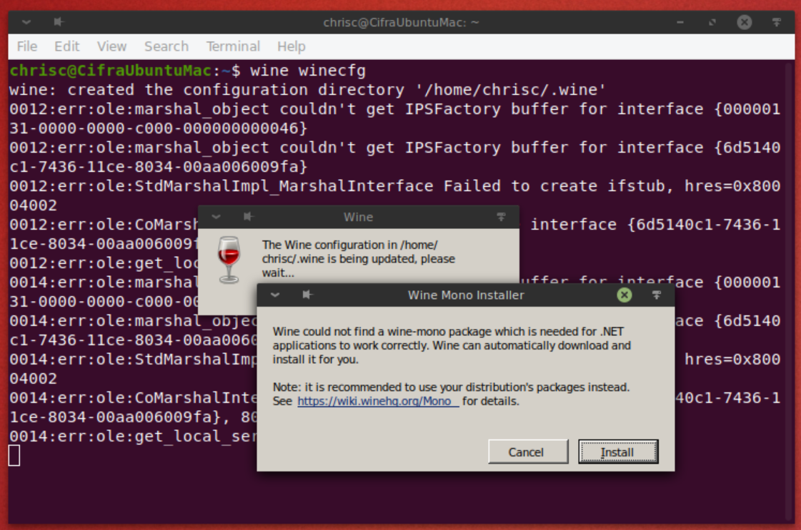

# A Guide To Running WPF Apps on Linux With .NET Core and Wine

## Overview

With the release of .NET Core 3.0 and it's support for WPF it is now possible to run a WPF app Linux by running the application under Wine.

For those who have not heard of Wine before, it is a compatibiliy layer which allows you to run Windows applications of Linux, and other OSes.
For more information you can read up on Wine at their website: [WineHQ](https://www.winehq.org/)

Wine, in my experience, is mostly used to enable users to run games on Linux, which is great for the WPF use case since WPF uses DirectX for rendering.

## Getting Started

First you need to port your WPF application to .NET Core. There are lots of great documents out there on how to do this. [This](https://docs.microsoft.com/en-us/dotnet/desktop-wpf/migration/convert-project-from-net-framework) is a great place to state.

One your app is working great on Windows you can give it a try on Linux.

### Install Wine on your Linux machine

.NET Core WPF Apps work well with current versions of Wine, but you may run into issues with older versions. I have tested various apps with [Wine 4.21](https://www.winehq.org/news/2019112901).

Once wine is installed you need to set it up. Running winecfg will is an easy way to get wine to setup the configuration directory.


When setting up the configuration directory Wine will prompt you to install Mono. You do not need to install Mono .NET to run .NET Core applications. You can cancel the install of Wine Mono.  Wine Gecko is also not needed.



Once wineconfig is up and running you should also have a .wine directory in your home directory:


### Install .NET Core on Wine

I find the easiest way to install .NET Core is to just copy the dotnet directory from your Windows install to the Linux machine.

Copy the entire dotnet folder from Windows:


to the Program Files directory in the Wine configuration location:


### Install your app on Linux

You can just copy the Windows build to anywhere on your Linux machine.

### Make sure you have fonts installed

### Run your app under Wine

once you app is copied to the Linux machine you can run it under Wine:

```
wine {location name of your app}
```

Here is a picture of the [Modern WPF](https://github.com/Kinnara/ModernWpf) example application running on Linux


## What do you do if the app does not work

I have not been able to get a debugger working with .NET Core apps running under Wine so you will have to rely on logging methods to debug issues that you run into.

### Console.Writeline

You can use Console.WriteLine to log any information you may need to debug issues. I highly recommend adding generous amounts of logging, asserts, and verification to your app.  When catching unexpected excetions be sure to log the exception and call stack from the exception so you can easily determine the location of the error.

I reccommend installing general exception handlers you can you catch unhandled exceptions and log them as well.

Dispatcher has an [UnhandledException](https://docs.microsoft.com/en-us/dotnet/api/system.windows.threading.dispatcher.unhandledexception?view=netcore-3.0) event you should register for.

AppDomain also has an [UnhandledException](https://docs.microsoft.com/en-us/dotnet/api/system.appdomain.unhandledexception?view=netcore-3.0) event that you should also register for.

### Wine Tracing

Wine is good at letting you know when your application calls unimplemented or partially implemented functionality.  These messages can greatly aid in tracking down issues.

In addition to the standard tracing of Wine you can configure even more event logging, including logging every call into Wine, to help you track down issues.  You can learn more about debug logging [Here](https://wiki.winehq.org/Wine_Developer%27s_Guide/Debug_Logging)

Also the Wine [Debugging Hints](https://wiki.winehq.org/Debugging_Hints) may provide some insights.

## Issues I ran into

### Rendering Issues with different Video Cards

I have experienced render issues depending on what manufacturer of video card I am using.
Nvidia cards do the best with only minor render issues.  Amd cards also do a decent job.  Intel video is basically unusable.  If you experience render issues (artifacts, clipping issues, ...) you will likely have better luck if you switch to software rendering.  You can do this by setting LIBGL_ALWAYS_SOFTWARE to 1.

``` text
export LIBGL_ALWAYS_SOFTWARE=1
```

#### HTTP Listener

#### Culture Enumeration

#### File System Security APIs

## Will WPF apps run on other OSes

WPF runs on DirectX 9 so any build of Wine with a reasonable DirectX support.

## Whats Next

When you run a WPF application on Linux as documented here you end up with an application that is something like this:


It would be great to be able to switch to .NET Core for Linux, keep using WPF, and have WPF Apps continue to work for the most part.  Then the appliations would have a boxology like this


To do this WPF needs to be updated to compile against [WineLib](https://wiki.winehq.org/Winelib_User%27s_Guide). In theory this should not be too difficult, but I have not tried this at all yet.

Switching to the Linux version of .NET Core would enable debugging and calling into native libraries without having to create a Wine wrapper DLL.
